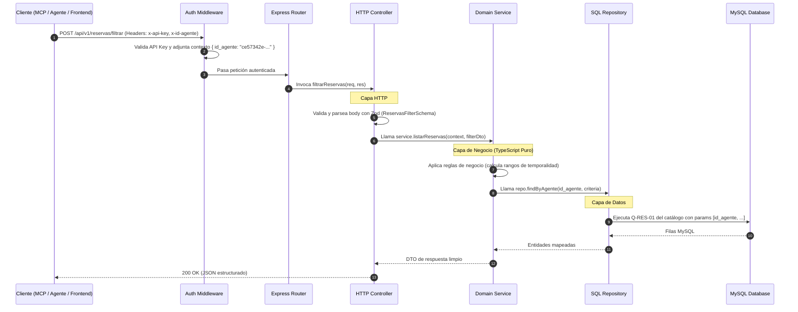

# 🏗️ Arquitectura Limpia y Pragmática (Clean Architecture Lite)

Este documento define los principios de diseño, la estructura de capas y la estrategia de escalabilidad para el **MIA Backend Gateway**, priorizando mantenibilidad, testabilidad y cero sobreingeniería.

> Este repo contiene **solo el backend**. Los servidores MCP y agentes de IA son clientes externos de esta API; su implementación no vive aquí.

---

## 1. ¿Por qué evolucionar la arquitectura anterior?

La arquitectura del backend viejo (`bacl`) funcionaba, pero tenía limitaciones estructurales:
* Controladores acoplados fuertemente a `req` y `res` de Express (imposibles de reutilizar o probar sin levantar un servidor HTTP).
* Lógica de base de datos y transacciones dispersas con estructuras de datos sin tipado fuerte (`any`).
* Manejo de errores basado en try/catch duplicados en cada controlador.

### Principios de la Nueva Arquitectura (Pragmatic Clean Architecture):

```
┌────────────────────────────────────────────────────────┐
│ 1. Capa Externa (HTTP / Express / Serverless Vercel)   │
│    Routes, Middlewares, DTO Parsing (Zod)              │
├────────────────────────────────────────────────────────┤
│ 2. Capa de Aplicación / Controladores HTTP             │
│    Convierte HTTP Request -> DTO tipado -> Llama Casos │
├────────────────────────────────────────────────────────┤
│ 3. Capa de Dominio / Casos de Uso (Servicios Puros)    │
│    Lógica de negocio pura, reglas de temporalidad      │
│    (Independiente de Express y de MySQL)               │
├────────────────────────────────────────────────────────┤
│ 4. Capa de Infraestructura / Repositorios              │
│    Ejecuta las queries del catálogo (QUERIES.md)       │
│    NO escribe SQL — solo lo ejecuta y mapea filas      │
└────────────────────────────────────────────────────────┘
```

> ⛔ **El SQL no se escribe en este repo.** Todas las queries las provee Ángel y viven en
> [QUERIES.md](./QUERIES.md). El repositorio es un ejecutor parametrizado, no un autor de SQL.

1. **Independencia del Framework Web:** El negocio vive en servicios TypeScript puros. Si mañana se migra de Express a Hono, Fastify o AWS Lambda, **los servicios y repositorios no cambian una sola línea**.
2. **Tipado Estricto de Entrada a Salida:** Los DTOs se validan con Zod en la entrada y los tipos de TypeScript se infieren automáticamente (`z.infer<typeof Schema>`).
3. **Inversión de Dependencias:** Los servicios dependen de interfaces de repositorio, lo que permite mockear la base de datos al 100% en los tests.
4. **Cero Sobreingeniería:** No usamos 10 capas abstractas de Java Enterprise; usamos 3 capas limpias y directas en TypeScript nativo.

---

## 2. Estructura de Carpetas del Proyecto

Organización modular por **Vertical Slices (Funcionalidades)**:

```
src/
  ├── core/                              # Capa transversal y utilidades base
  │     ├── config/                      # Variables de entorno y DB pool
  │     ├── errors/                      # Jerarquía de errores de dominio (AppError, NotFoundError, UnauthorizedError)
  │     ├── middleware/                  # Auth (x-api-key + id_agente), request tracing
  │     └── types/                       # Tipos globales y Contexto de petición
  │
  ├── modules/                           # Módulos de dominio (Vertical Slices)
  │     ├── reservas/
  │     │     ├── dtos/                  # Schemas Zod y tipos inferidos (Input / Output)
  │     │     ├── reservas.controller.ts # Adaptador HTTP (req/res -> DTO)
  │     │     ├── reservas.service.ts    # Caso de uso y reglas de negocio
  │     │     ├── reservas.queries.ts    # Queries del catálogo, copiadas literal (no editables)
  │     │     ├── reservas.repository.ts # Ejecuta las queries con params seguros
  │     │     └── reservas.router.ts     # Definición de rutas Express
  │     │
  │     ├── cupones/                     # Módulo de cupones (Hotel, Vuelo, Auto)
  │     ├── viajeros/                    # Módulo optimizado de directorio de pasajeros
  │     └── finanzas/                    # Módulo de Wallet y Línea de crédito
  │
  ├── app.ts                             # Configuración y ensamble de Express
  └── server.ts                          # Entrada local
api/
  └── index.ts                           # Entrada Serverless para Vercel
tests/                                   # Suite de pruebas automatizadas (Vitest)
  ├── unit/
  └── integration/
```

---

## 3. Flujo de Datos y Separación de Capas



---

## 4. Manejo de Errores Tipados (Domain Errors)

En lugar de lanzar errores genéricos de JavaScript, usamos clases de error con semántica HTTP automática:

```typescript
// core/errors/AppError.ts
export class AppError extends Error {
  constructor(
    public readonly message: string,
    public readonly statusCode: number = 500,
    public readonly code: string = "INTERNAL_SERVER_ERROR",
    public readonly details?: unknown
  ) {
    super(message);
  }
}

export class ValidationError extends AppError {
  constructor(message: string, details?: unknown) {
    super(message, 400, "VALIDATION_ERROR", details);
  }
}

export class NotFoundError extends AppError {
  constructor(entity: string, id?: string | number) {
    super(`${entity} no encontrado${id ? ` con ID ${id}` : ""}`, 404, "NOT_FOUND");
  }
}
```

El middleware global `errorHandler` captura estos errores y devuelve una respuesta estructurada y predecible para cualquier cliente:

```json
{
  "success": false,
  "error": {
    "code": "VALIDATION_ERROR",
    "message": "Filtro inválido: 'temporalidad' es obligatorio ('proximas' | 'pasadas')",
    "statusCode": 400
  }
}
```
