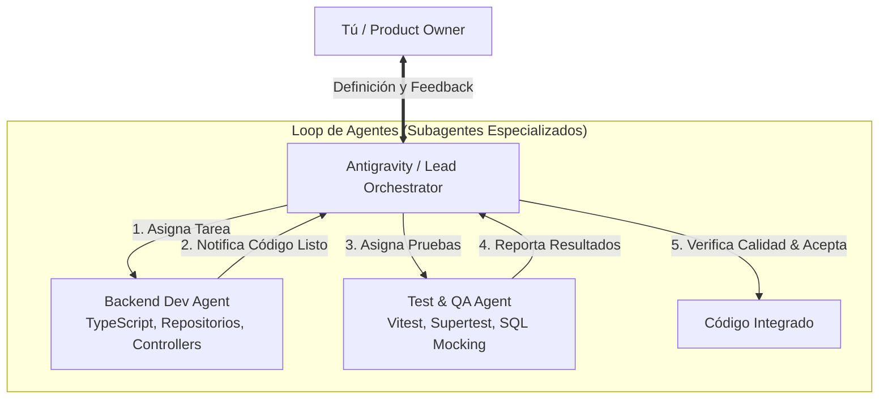

# 🤖 Loop de Desarrollo Multi-Agente (Orchestration Loop)

Este documento define el modelo de trabajo para construir el backend mediante un **Loop de Agentes Autónomos** coordinados por un Orquestador / Lead Architect.

> Alcance: este loop construye **el backend de este repo**. Los clientes que lo consumen (servidores MCP, agentes, frontends) están fuera del alcance de estas tareas.

---

## 1. Roles y Responsabilidades



| Rol | Agente | Responsabilidad |
| :--- | :--- | :--- |
| **Product Owner** | **Tú** | Define prioridades, aprueba arquitecturas y valida la experiencia de negocio. |
| **Lead Architect & Orquestador** | **Antigravity (Main Agent)** | Desglosa épicas en tareas atómicas, lanza subagentes, revisa PRs/código, valida tests y acepta entregables. |
| **Backend Dev Agent** | Subagente `self` (Write) | Escribe módulos en TypeScript, repositorios SQL, controladores y esquemas Zod. |
| **Test & QA Agent** | Subagente `self` (Write/Run) | Escribe tests unitarios/integración con Vitest/Supertest y valida que pasen al 100%. |

---

## 2. Ciclo del Loop de Tareas (Task Loop)

Para cada funcionalidad (ej. Módulo de Reservas, Módulo de Cupones):

```
┌──────────────────────────────────────────────────────────┐
│ Paso 1: Orquestador crea Task y define el contrato Zod  │
└────────────────────────────┬─────────────────────────────┘
                             │
                             ▼
┌──────────────────────────────────────────────────────────┐
│ Paso 2: Backend Dev Agent implementa Router/Service/Repo │
└────────────────────────────┬─────────────────────────────┘
                             │
                             ▼
┌──────────────────────────────────────────────────────────┐
│ Paso 3: QA Agent genera tests y corre suite de pruebas   │
└────────────────────────────┬─────────────────────────────┘
                             │
                             ▼
┌──────────────────────────────────────────────────────────┐
│ Paso 4: Orquestador verifica coverage y hace el merge    │
└──────────────────────────────────────────────────────────┘
```

---

## 3. Backlog de Tareas

La especificación completa de cada tarea vive en [`tasks/`](./tasks/). El estado actual se sigue en [PROGRESS.md](./PROGRESS.md).

| ID | Tarea | Depende de |
| :--- | :--- | :--- |
| [TASK-001](./tasks/TASK-001-setup.md) | Setup del proyecto y entorno Vercel | — |
| [TASK-002](./tasks/TASK-002-core-auth-db.md) | Capa core: DB, errores y middleware auth | TASK-001 |
| [TASK-003](./tasks/TASK-003-reservas.md) | Módulo Reservas | TASK-002 |
| [TASK-004](./tasks/TASK-004-cupones.md) | Módulo Cupones | TASK-003 |
| [TASK-005](./tasks/TASK-005-viajeros-finanzas.md) | Módulos Viajeros y Finanzas | TASK-002 |
| [TASK-006](./tasks/TASK-006-integration-tests.md) | Suite de pruebas de integración | TASK-005 |

---

## 4. Definition of Done Verificable

Una tarea **no se marca completa** por checkbox. Se marca completa cuando:

1. `npm run build` compila sin errores de TypeScript.
2. `npm test` pasa — y la suite **es capaz de fallar** (ver regla anti-mock abajo).
3. Los archivos entregables listados en la tarea existen en disco.

### Regla anti-mock (crítica para el loop)

Un agente que escribe el mock y el test contra su propio mock produce tests verdes que no prueban nada. Para evitarlo:

- Los fixtures de datos **se derivan de filas reales** de la DB de MIA (anonimizadas), no se inventan.
- Todo test de repositorio debe verificar el **SQL generado y sus parámetros**, no solo la respuesta mockeada.
- Todo módulo debe incluir al menos un test negativo: consulta **sin** `id_agente` → debe fallar; filtro requerido ausente → debe fallar con 400.

### El agente no escribe SQL

**Los agentes no conocen la base de datos.** No hay esquema, DDL ni tablas documentadas en este repo — a propósito.

Todas las queries las provee Ángel y viven en [QUERIES.md](./QUERIES.md). El repositorio las ejecuta con parámetros seguros y mapea las filas; nada más.

Si una tarea necesita datos sin query aprobada, el agente **detiene la tarea** y emite una *Solicitud de Query* ([QUERIES.md §3](./QUERIES.md)). No inventa SQL, no propone un esquema, no deja un stub para "avanzar mientras tanto".

Esto es lo que hace que el loop sea seguro de correr sin supervisión continua: el punto donde un agente autónomo más fácilmente produce daño invisible — SQL plausible contra un esquema que no conoce — está cerrado por diseño.
