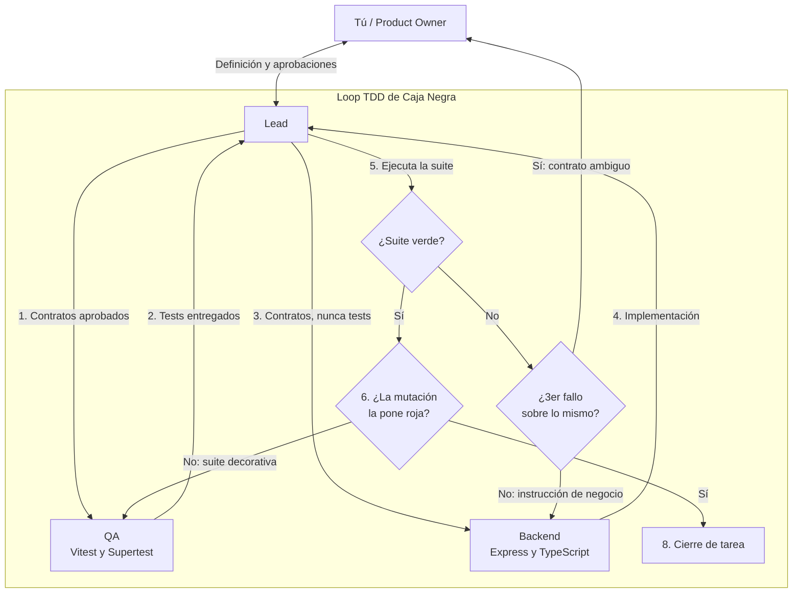

# 🤖 Loop de Desarrollo Multi-Agente (Orchestration Loop)

Este documento define el modelo de trabajo para construir el backend mediante un **Loop de Agentes Autónomos** coordinados por un **Lead Orchestrator** bajo TDD de caja negra.

> Alcance: este loop construye **el backend de este repo**. Los clientes que lo consumen (servidores MCP, agentes, frontends) están fuera del alcance de estas tareas.

---

## 1. Roles y Responsabilidades

> **Estos nombres son los únicos válidos en todo el repo.** `PROGRESS.md` y los archivos de
> `tasks/` usan exactamente `Lead`, `QA`, `Backend`, `Security` y `Test Runner`. Tres vocabularios
> para los mismos cinco roles es ambigüedad gratuita para un agente que entra en frío.

| Rol | Agente | Responsabilidad |
| :--- | :--- | :--- |
| **Product Owner** | **Ángel** | Define prioridades, entrega las queries, aprueba arquitecturas y resuelve las escaladas del tope de iteraciones. |
| **Lead** | Agente principal | Desglosa tareas, mantiene la segregación, ejecuta e interpreta la suite, corre la verificación de mutación y acepta o rechaza entregables. |
| **QA** | Subagente especializado | Escribe tests Vitest/Supertest antes de la implementación, en `tests/`, usando únicamente los contratos aprobados y sin inspeccionar el código del Backend. |
| **Backend** | Subagente especializado | Implementa Express + TypeScript desde contratos e instrucciones de negocio. No lee ni ejecuta `tests/`. Su brief es [`agents/BACKEND.md`](./agents/BACKEND.md). |
| **Test Runner** | Ejecutor mecánico opcional | Ejecuta comandos de prueba por delegación y devuelve la salida íntegra al Lead; no interpreta resultados ni modifica archivos. |
| **Security** | Subagente especializado, estacionado | Hace una auditoría acumulada antes de liberar el proyecto, únicamente después de que toda la suite esté verde y las mutaciones de las tareas hayan producido rojo. No se invoca automáticamente por tarea. |

---

## 2. Ciclo del Loop de Tareas (Task Loop)

Para cada funcionalidad (por ejemplo, Reservas o Cupones):

1. El Lead fija el contrato y entrega a QA únicamente las fuentes contractuales aprobadas. El catálogo [QUERIES.md](./QUERIES.md) funciona como contrato de persistencia cuando aplica.
2. QA escribe primero los tests en `tests/` (§2.1) y avisa al Lead.
3. El Lead encarga la implementación al Backend, entregándole su brief ([`agents/BACKEND.md`](./agents/BACKEND.md)) más los contratos e instrucciones de negocio. No comparte tests, expectativas literales, fixtures ni trazas de aserciones.
4. El Backend entrega el código sin leer ni ejecutar la suite. Su revisión local se limita a `npm run build`, lint y `npm run check:invariants` — comprobaciones que no revelan los tests de QA.
5. El Lead ejecuta la suite, o delega el comando a un Test Runner mecánico. En ambos casos, solo el Lead inspecciona e interpreta el resultado completo.
6. **Verificación de mutación (§2.3).** Con la suite en verde, el Lead comprueba que la suite es *capaz* de ponerse roja. Si no lo es, la tarea se rechaza aunque todo pase.
7. Ante un fallo, el Lead identifica la causa lógica y devuelve al Backend una instrucción de negocio siguiendo el protocolo de §2.2, que fija exactamente qué se transmite y qué no.
8. Cuando compilación, invariantes y suite funcional están verdes —y la mutación produjo rojo—, el
   Lead cierra la tarea si cumple el DoD. Security permanece estacionado durante la implementación.

Después de completar TASK-006 y antes de liberar el proyecto, Security ejecuta **una auditoría
acumulada** sobre aislamiento multi-tenant, validaciones y límites de confianza. Sus hallazgos regresan
al Lead y cualquier regresión sigue el mismo ciclo QA → Backend → suite → mutación. Ángel puede pedir
una auditoría extraordinaria antes, pero no se dispara automáticamente por tarea.

La segregación es obligatoria: QA no adapta pruebas a la implementación y Backend no se autocorrige a ciegas ejecutando pruebas ajenas.

### Política de costo: QA por lotes

QA permanece estacionado entre lotes para evitar recargar contexto en cada transición. Puede preparar
en una sola activación las pruebas de varias tareas cuyos contratos ya estén cerrados, siempre que se
respete para cada una la condición esencial: sus pruebas existen y la fase roja se verifica **antes**
de que Backend reciba esa implementación.

- Lote A: TASK-002b y pruebas contractuales de TASK-003.
- Lote B: TASK-004, TASK-005 y TASK-006 cuando sus siete queries pendientes estén aprobadas.
- QA no se reactiva por un fallo ordinario de Backend; el Lead devuelve una instrucción de negocio.
  Solo vuelve antes del siguiente lote si una mutación demuestra que la suite no protege el contrato
  o si el propio test contradice una fuente contractual.

---

### 2.1. Segregación de los tests

Los tests de QA viven en `tests/`, dentro del mismo repo. La segregación es una **regla explícita**, no un límite del sistema de archivos: el Backend puede técnicamente abrir `tests/`, y no lo hace.

- `tests/` es territorio de QA. El Backend no lo lee, no lo edita y no ejecuta `npm test`.
- La validación local del Backend es `npm run build`, `lint` y `npm run check:invariants` — ninguno necesita mirar `tests/`.
- El Lead es el único que ejecuta la suite. Si delega a un Test Runner, el Runner devuelve la salida íntegra sin interpretarla.

#### Quién ejecuta qué comandos

Esta tabla es la que hace operativa la segregación. **El Lead sí ejecuta comandos** — no delega la suite a nadie que pueda leer el resultado.

| Comando | Lead | Backend | QA | Security |
| :--- | :---: | :---: | :---: | :---: |
| `npm run build` | ✅ | ✅ | — | ✅ |
| `npm run lint` | ✅ | ✅ | — | — |
| `npm run check:invariants` | ✅ | ✅ | — | ✅ |
| `npm test` | ✅ **exclusivo** | ❌ **nunca** | ⚠️ solo fase roja | ❌ |
| Mutación (editar → correr → revertir) | ✅ **exclusivo** | ❌ | ❌ | ❌ |
| Peticiones HTTP contra la app levantada | ✅ | ✅ | ✅ | ✅ |

**⚠️ Fase roja de QA.** QA puede correr la suite **antes de que exista la implementación**, para confirmar que sus tests son ejecutables y fallan por la razón correcta. Es el "red" de red-green-refactor. En cuanto el Backend entrega, QA deja de correrla: a partir de ahí, ver qué falla contra una implementación real es exactamente el material con el que se adaptaría el test.

> **Por qué el Lead no puede delegar `npm test` a un subagente cualquiera.** El valor entero del
> loop está en que una sola parte vea el resultado. Un Test Runner mecánico es aceptable porque
> devuelve la salida íntegra sin interpretarla ni actuar sobre ella; un subagente que implementa o
> escribe tests, no — en cuanto ve el output, deja de derivar del contrato y empieza a derivar del
> resultado.

La regla se le entrega al Backend en su brief, [`agents/BACKEND.md`](./agents/BACKEND.md), que es el documento que el Lead le pasa al arrancar cada tarea.

> ⚠️ **Esto es una convención, no una garantía.** Un límite real sería sacar `tests/` del árbol de
> trabajo del Backend; se evaluó y se descartó por el coste operativo frente al tamaño del proyecto.
> La consecuencia es que la integridad del loop no puede descansar sobre esta regla sola: descansa
> sobre los dos controles que **no** dependen de que un agente obedezca — el gate mecánico de
> invariantes (§3) y la verificación de mutación (§2.3). Si alguna vez hay que recortar algo del
> loop, no sean esos dos.

---

### 2.2. Protocolo de feedback ante fallo

"Instrucción de negocio, nunca detalles" es la intención correcta, pero deja la frontera al criterio del Lead en cada fallo. Esta es la frontera:

| ✅ El Lead **sí** transmite | ❌ El Lead **nunca** transmite |
| :--- | :--- |
| El request completo que se envió | Nombre del archivo o del caso de test |
| El status code y el cuerpo que se obtuvo | Texto literal de la aserción |
| El comportamiento esperado, en lenguaje de negocio | Valores esperados y fixtures |
| El endpoint y el módulo afectados | La traza de la aserción o el diff de Vitest |

**Ejemplo.** El test falla porque el repositorio no aplica el filtro de temporalidad.

- ❌ *"`reservas.test.ts:42` espera `data.length === 2` y recibió `5`."*
- ✅ *"`POST /reservas/filtrar` con `temporalidad: 'proximas'` está devolviendo reservas cuyo check-in ya pasó. El filtro de temporalidad no se está aplicando."*

La segunda versión describe el problema de negocio; obliga a arreglar la causa. La primera invita a parchear hasta que el número coincida.

**Tope de iteraciones — el loop tiene salida.**

> Máximo **3 iteraciones** sobre el mismo test fallando. A la tercera, el Lead **detiene la tarea**
> y escala a Ángel con: el contrato relevante, las 3 instrucciones que ya dio, y qué sigue fallando.

Sin este tope el loop no tiene condición de salida ante un fallo persistente: gira mientras haya presupuesto. Tres fallos sobre lo mismo casi nunca son un Backend torpe — suelen ser un contrato ambiguo, y eso lo resuelve una persona, no otra vuelta del loop.

---

### 2.3. Verificación de mutación

El DoD exige que la suite sea "capaz de fallar". Así se comprueba, y no es opcional:

1. Con la suite en verde, el Lead introduce **una** mutación deliberada en el código del Backend:
   - quitar el `id_agente` del array de parámetros del repositorio, **o**
   - forzar `return []` en el método principal del repositorio, **o**
   - eliminar un filtro requerido del schema Zod.
2. Corre la suite.
3. **Debe ponerse roja.** Si sigue verde, la suite no prueba nada: la tarea se rechaza y vuelve a QA, no al Backend.
4. El Lead revierte la mutación y confirma que vuelve a verde.

Cuesta un minuto y es la única defensa real contra una suite decorativa. Registra en `PROGRESS.md` qué mutación se usó y qué test la detectó.

---

## 3. Principios de implementación

- Arquitectura limpia: `Router → Controller → Service → Repository`.
- Validación de entradas con Zod y cero uso de `any`.
- Despliegue Vercel Serverless y pool MySQL reutilizable para evitar agotar conexiones.
- `id_agente` es un UUID obtenido del contexto autenticado; nunca se confía en un valor enviado en body, query o params.
- Antes de lanzar errores de negocio, se emite un log estructurado con `console.error()` o `console.log()` que permita diagnosticar el evento en Vercel sin exponer secretos.

### Gate mecánico de invariantes

Las tres invariantes de [QUERIES §5](./QUERIES.md) no dependen de que un agente las encuentre revisando código. Son un script, `npm run check:invariants`, que falla el build si:

1. Aparece un backtick o una concatenación con `+` dentro de cualquier `*.queries.ts` — señal de SQL construido dinámicamente.
2. Aparece `id_agente` leído de `req.body`, `req.query` o `req.params` en cualquier archivo.
3. Un repositorio ejecuta un string de SQL que no es una constante importada de un `*.queries.ts`.

Corre en cada commit y lo ejecuta también el Backend antes de entregar (paso 4). Es determinista y no revela nada de los tests de QA. Se entrega en [TASK-001](./tasks/TASK-001-setup.md).

---

## 4. Backlog de Tareas

La especificación completa de cada tarea vive en [`tasks/`](./tasks/). El estado actual se sigue en [PROGRESS.md](./PROGRESS.md).

| ID | Tarea | Depende de |
| :--- | :--- | :--- |
| [TASK-001](./tasks/TASK-001-setup.md) | Setup del proyecto, gate de invariantes y entorno Vercel | — |
| [TASK-002](./tasks/TASK-002-core-auth-db.md) | Capa core: DB, errores y middleware auth | TASK-001 |
| [TASK-002b](./tasks/TASK-002b-testing-infra.md) | Infraestructura de testing: `mockExecutor` y fixtures | TASK-002 |
| [TASK-003](./tasks/TASK-003-reservas.md) | Módulo Reservas | TASK-002b |
| [TASK-004](./tasks/TASK-004-cupones.md) | Módulo Cupones | TASK-003 |
| [TASK-005](./tasks/TASK-005-viajeros-finanzas.md) | Módulos Viajeros y Finanzas | TASK-002b |
| [TASK-006](./tasks/TASK-006-integration-tests.md) | Consolidación de la suite y cobertura | TASK-005 |

> **TASK-002b existe porque el orden anterior era imposible.** TASK-003 pedía "tests con mock de
> base de datos", pero el helper que define ese mock se construía en TASK-006, tres tareas después.
> El resultado garantizado era que QA improvisara un mock distinto en cada módulo y TASK-006 los
> reescribiera todos. La infraestructura de testing es una **dependencia** del primer módulo, no
> una consecuencia del último.

Las queries pendientes que bloquean TASK-003, TASK-004 y TASK-005 se siguen en [QUERIES §1](./QUERIES.md) — única tabla de estado.

---

## 5. Definition of Done Verificable

Una tarea **no se marca completa** por checkbox. Se marca completa cuando:

1. `npm run build` compila sin errores de TypeScript.
2. `npm run check:invariants` pasa.
3. `npm test` pasa.
4. La **verificación de mutación** (§2.3) pone la suite en rojo, y revertirla la devuelve a verde.
5. Los archivos entregables listados en la tarea existen en disco.

Los cinco. Una suite verde cuya mutación no produce rojo es una suite decorativa: el punto 4 es lo que convierte el punto 3 en evidencia.

### Regla anti-mock (crítica para el loop)

Un agente que escribe el mock y el test contra su propio mock produce tests verdes que no prueban nada. Para evitarlo:

- Los fixtures **se construyen desde las filas de ejemplo anonimizadas que Ángel entrega con cada query** ([QUERIES §2](./QUERIES.md)). El agente no inventa filas: no tiene acceso a la DB, y unos datos inventados por él son exactamente el mock contra el que no debe probar.
- Todo test de repositorio verifica **qué query del catálogo se ejecutó y con qué parámetros** — no que el SQL sea correcto (el agente no conoce el esquema y no puede juzgarlo). En concreto: que el string ejecutado es idéntico al del catálogo, y que el primer parámetro es el `id_agente` del contexto.
- Todo módulo incluye al menos un test negativo: petición **sin** `x-id-agente` → 400 `MISSING_CONTEXT` sin llegar al repositorio; filtro requerido ausente → 400 `VALIDATION_ERROR`.

### El agente no escribe SQL

**Los agentes no conocen la base de datos.** No hay esquema, DDL ni tablas documentadas en este repo — a propósito.

Todas las queries las provee Ángel y viven en [QUERIES.md](./QUERIES.md). El repositorio las ejecuta con parámetros seguros y mapea las filas; nada más.

Si una tarea necesita datos sin query aprobada, el agente **detiene la tarea** y emite una *Solicitud de Query* ([QUERIES.md §3](./QUERIES.md)). No inventa SQL, no propone un esquema, no deja un stub para "avanzar mientras tanto".

Esto es lo que hace que el loop sea seguro de correr sin supervisión continua: el punto donde un agente autónomo más fácilmente produce daño invisible — SQL plausible contra un esquema que no conoce — está cerrado por diseño.
