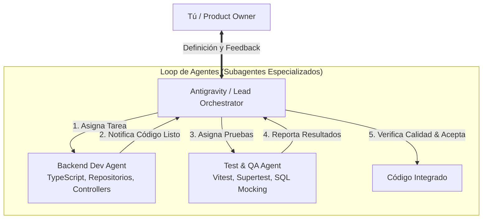

# 🤖 Loop de Desarrollo Multi-Agente (Orchestration Loop)

Este documento define el modelo de trabajo para construir el backend mediante un **Loop de Agentes Autónomos** coordinados por Antigravity (Orquestador / Lead Architect).

---

## 1. Roles y Responsabilidades



| Rol | Agente | Responsabilidad |
| :--- | :--- | :--- |
| **Product Owner** | **Tú** | Define prioridades, aprueba arquitecturas y valida la experiencia de negocio. |
| **Lead Architect & Orquestador** | **Antigravity (Main Agent)** | Desglosa épicas en tareas atómicas, lanza subagentes, revisa PRs/código, valida tests y acepta entregables. |
| **Backend Dev Agent** | Subagente `self` (Write) | Escribe módulos en TypeScript, repositorios SQL, controladores y esquemas Zod. |
| **Test & QA Agent** | Subagente `self` (Write/Run) | Escribe tests unitarios/integración con Vitest/Supertest y valida que pasen al 100%. |

---

## 2. Ciclo del Loop de Tareas (Task Loop)

Para cada funcionalidad (ej. Módulo de Reservas, Módulo de Cupones):

```
┌──────────────────────────────────────────────────────────┐
│ Paso 1: Orquestador crea Task y define el contrato Zod  │
└────────────────────────────┬─────────────────────────────┘
                             │
                             ▼
┌──────────────────────────────────────────────────────────┐
│ Paso 2: Backend Dev Agent implementa Router/Service/Repo │
└────────────────────────────┬─────────────────────────────┘
                             │
                             ▼
┌──────────────────────────────────────────────────────────┐
│ Paso 3: QA Agent genera tests y corre suite de pruebas   │
└────────────────────────────┬─────────────────────────────┘
                             │
                             ▼
┌──────────────────────────────────────────────────────────┐
│ Paso 4: Orquestador verifica coverage y hace el merge    │
└──────────────────────────────────────────────────────────┘
```

---

## 3. Backlog Inicial de Tareas

1. **TASK-01: Setup del Proyecto**
   - `package.json`, `tsconfig.json`, dependencias (`express`, `zod`, `mysql2`, `dotenv`, `cors`, `vitest`).
   - Configuración serverless de Vercel (`api/index.ts` + `vercel.json`).
   - Pool de base de datos (`config/db.ts`) con patrón `getExecutor(conn)`.
2. **TASK-02: Middleware de Seguridad & Multi-Tenant**
   - Validación de `x-api-key`.
   - Inyección y validación de `id_agente` en `req.context`.
   - `errorHandler` global con `CustomError`.
3. **TASK-03: Módulo Reservas (`/reservas`)**
   - Repositorio sobre `vw_new_details_booking` con filtros de temporalidad (`proximas`/`pasadas`).
   - Controlador y Service con Zod.
   - Tests de integración.
4. **TASK-04: Módulo Cupones (`/cupones`)**
   - Adaptación de la lógica de `v2/cupon` para resolver `sol-...` y bookings individuales.
   - Tests de integración.
5. **TASK-05: Módulos Viajeros y Finanzas**
   - Queries optimizadas para viajeros por agente.
   - Consulta consolidada de wallet y línea de crédito.
   - Tests de integración.
