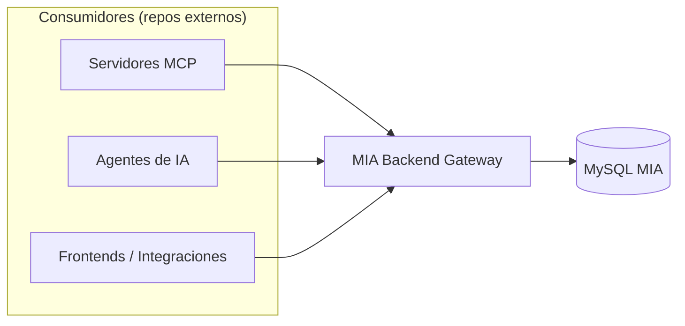
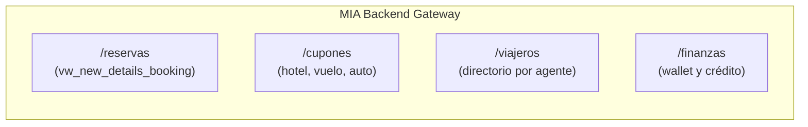

# 🚀 MIA Backend Gateway

Backend API REST en TypeScript construido con arquitectura limpia, pensado para **escalar de forma ordenada** a medida que crece el catálogo de endpoints y consumidores.

Se conecta directamente a la base de datos de MIA y expone endpoints tipados, compactos y predecibles para consultar reservas, cupones, viajeros y finanzas, sin arrastrar la deuda estructural del backend legacy (`bacl`).

> **Alcance de este repositorio:** aquí se construye **únicamente el backend**.
> Los servidores MCP, agentes de IA y demás clientes son **consumidores externos** que viven en sus propios repos y se conectan a esta API. Nada de la implementación de un MCP se desarrolla aquí.

---

## 🎯 Objetivos Principales

1. **Aislamiento Multi-Tenant:** Toda consulta filtra estrictamente por el `id_agente` autenticado. Sin excepción.
2. **Payloads Compactos:** Respuestas sin campos basura de interfaz gráfica — barato de consumir para cualquier cliente, incluidos los que pagan por token.
3. **Escalabilidad Estructural:** Módulos aislados (vertical slices) para que agregar un dominio nuevo no obligue a tocar los existentes.
4. **Alto Rendimiento en Serverless (Vercel):** TypeScript + Express con arranque en frío menor a 150ms.
5. **Testabilidad Real:** Lógica de negocio en servicios puros, desacoplados de Express y de MySQL.

---

## 👥 Consumidores de esta API



Ningún consumidor recibe trato especial: todos hablan el mismo contrato REST autenticado con `x-api-key` + `x-id-agente`.

---

## 📚 Índice de Documentación

| Documento | Descripción |
| :--- | :--- |
| 🤝 [HANDOFF.md](./HANDOFF.md) | **Empieza aquí.** Estado, siguientes pasos y decisiones ya cerradas. |
| 🏗️ [ARCHITECTURE.md](./ARCHITECTURE.md) | Capas, estructura modular, manejo de errores y despliegue. |
| 📋 [API_CONTRACT.md](./API_CONTRACT.md) | Contrato de API para consumidores (formato Markdown, sin Swagger). |
| 🗄️ [QUERIES.md](./QUERIES.md) | **Catálogo de queries autorizadas.** Única fuente de acceso a datos. |
| 🤖 [ORCHESTRATION_LOOP.md](./ORCHESTRATION_LOOP.md) | Flujo de desarrollo iterativo con agentes y tareas atómicas. |
| 📊 [PROGRESS.md](./PROGRESS.md) | Tablero de estado de tareas y avance. |

---

## 🧰 Módulos Planeados



---

## ⚙️ Variables de Entorno (`.env`)

Ver [.env.example](./.env.example) para la plantilla completa.

```env
PORT=3002
NODE_ENV=development

# Base de Datos MySQL
DB_HOST=localhost
DB_USER=root
DB_PASSWORD=secret
DB_NAME=mia_db
DB_PORT=3306

# Seguridad
API_KEY=api_key_para_clientes_de_esta_api
```
