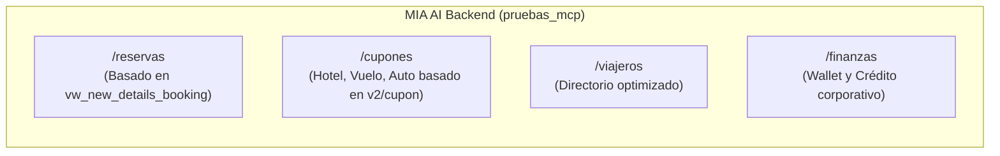

# 🚀 MIA AI Backend Gateway — API Especializada para MCP y Agentes

Backend API REST de alto rendimiento y bajo overhead diseñado específicamente para servir como **fuente de datos segura y optimizada para servidores MCP (Model Context Protocol) y agentes de Inteligencia Artificial**.

Este microservicio se conecta a la base de datos de MIA y expone endpoints limpios, tipados y estructurados para consultar reservas, cupones, viajeros y finanzas de clientes/agencias sin la sobrecarga del backend legacy.

---

## 🎯 Objetivos Principales

1. **Aislamiento Multi-Tenant:** Cada llamada requiere y filtra estrictamente por `id_agente` autenticado.
2. **Optimización para LLMs (Token-Efficiency):** Payloads compactos sin campos basura de interfaz gráfica.
3. **Alto Rendimiento en Serverless (Vercel):** Arquitectura modular en TypeScript + Express con arranque en frío menor a 150ms.
4. **Desarrollo Orquestado por Agentes:** Construcción iterativa mediante un loop multi-agente (Orquestador, Backend Dev Agent y Test/QA Agent).

---

## 📚 Índice de Documentación de Planeación

| Documento | Descripción |
| :--- | :--- |
| 🏗️ [ARCHITECTURE.md](./ARCHITECTURE.md) | Análisis de tecnologías (NestJS vs Express/TS en Vercel), estructura modular y despliegue. |
| 📋 [API_CONTRACT.md](./API_CONTRACT.md) | Contrato de API detallado para liderazgo y clientes MCP (sin Swagger, formato Markdown). |
| 🗄️ [DATABASE_SCHEMA.md](./DATABASE_SCHEMA.md) | Documentación de vistas SQL (`vw_new_details_booking`) y tablas consumidas. |
| 🤖 [ORCHESTRATION_LOOP.md](./ORCHESTRATION_LOOP.md) | Flujo de trabajo del loop de desarrollo con agentes autónomos y tareas. |

---

## 🧰 Módulos y Endpoints Principales



---

## ⚙️ Variables de Entorno Previstas (`.env`)

```env
PORT=3002
NODE_ENV=development

# Base de Datos MySQL
DB_HOST=localhost
DB_USER=root
DB_PASSWORD=secret
DB_NAME=mia_db
DB_PORT=3306

# Seguridad
API_KEY=tu_api_key_segura_para_el_mcp
```
